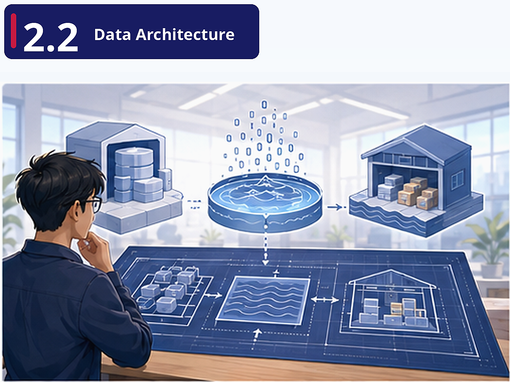

# Pre-class Brief

## Where are we?

Your manager asks you to sketch out what FreshCart's future data platform should look like. But you quickly realise there are many possible designs. 

Should the company use a data warehouse, a data lake, or a data lakehouse? 

Should systems be centralised or decentralised? 

You need to understand the architectural options before making recommendations.

## Why this matters

Data architecture is the blueprint. Getting it wrong means expensive rework later. A junior data engineer won't design the architecture alone, but you *will* be asked to implement parts of it — and you need to understand why certain decisions were made. More practically, "data warehouse vs data lake" and "Lambda vs Kappa architecture" are interview staples.

## Key concepts

**Data Warehouse vs Data Lake vs Data Lakehouse** — FreshCart's structured order data fits a warehouse. The unstructured product images and semi-structured delivery logs don't. The lakehouse model is the modern compromise. Understanding these trade-offs is what separates a data engineer from someone who just follows tutorials.

**Replication and Partitioning** — The two fundamental mechanisms for scaling distributed data systems. Replication gives you fault tolerance (if one server dies, another has a copy). Partitioning gives you throughput (split the workload). Every cloud database you'll ever use implements both.

**Data Architecture Principles** — Especially "Common Vocabulary" and "Data as a Shared Asset." FreshCart's problem ("nobody trusts the numbers") is often a governance problem, not a technology one. When the marketing team's definition of "active customer" differs from the product team's, no amount of infrastructure fixes the issue.
